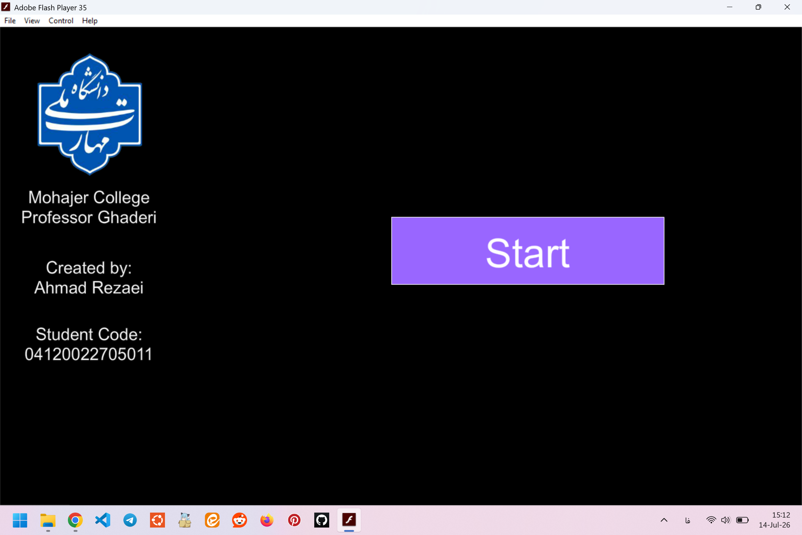
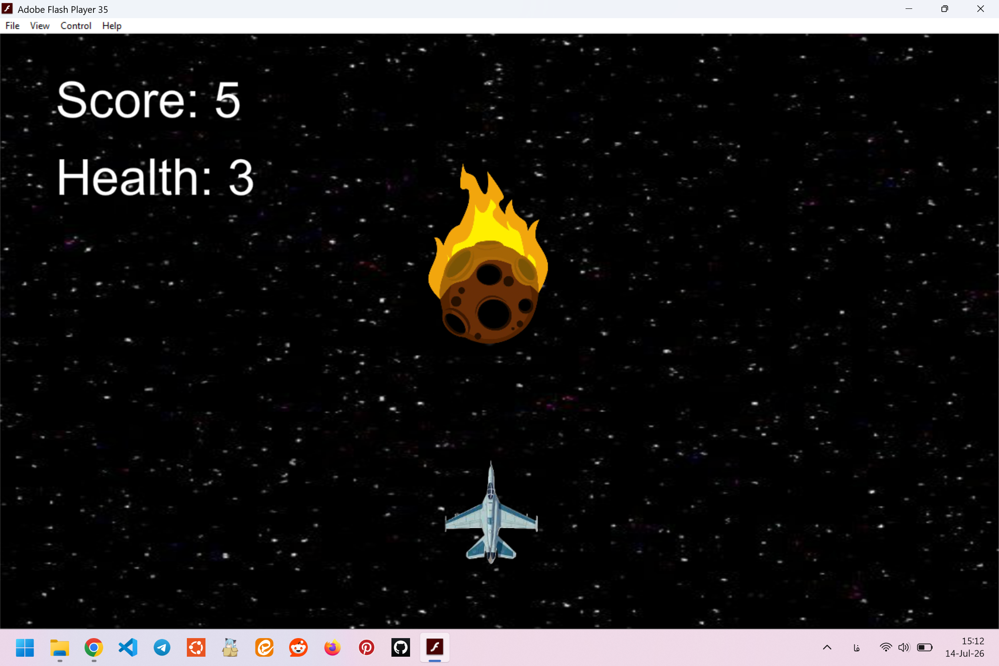
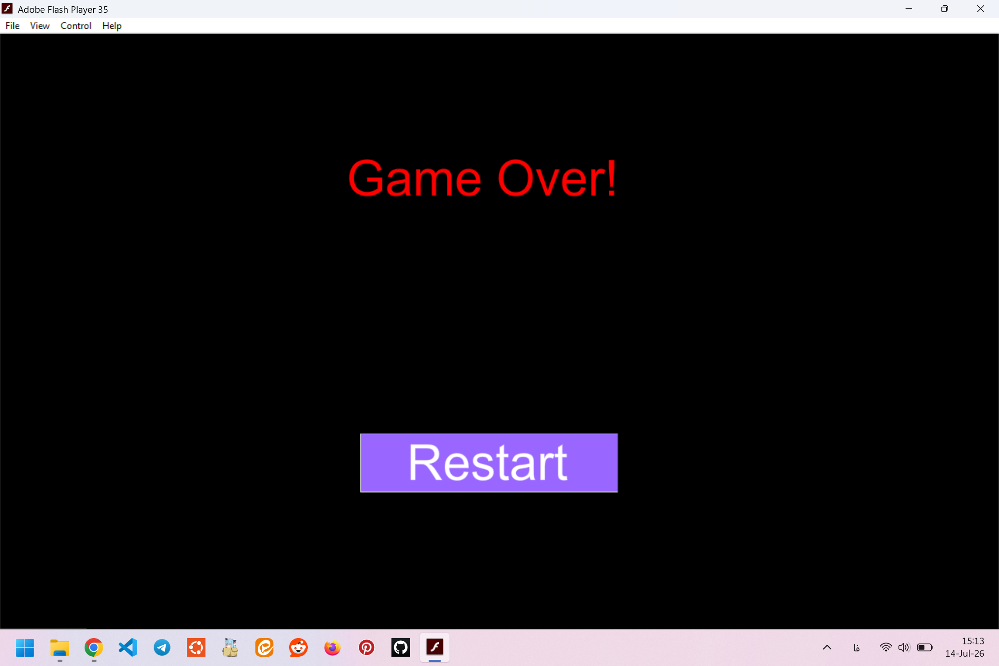

# 🚀 Space Dodger - 2D Asteroid Evasion Game

A classic, action-packed 2D arcade game built using Adobe Animate. Players control a spaceship navigating through a dangerous asteroid field, aiming to survive as long as possible while racking up a high score.

---

## 🛠️ Tools & Technologies
* **Development Platform:** Adobe Animate (Adobe Flash Player 35)
* **Scripting language:** ActionScript 3.0 / JavaScript (depending on your project type)
* **Design & Animation:** Vector-based asset handling and timeline manipulation

---

## 🎮 Gameplay & Key Features

* **Arrow Key Controls:** Seamless spaceship movement mapped to the keyboard arrow keys for responsive handling.
* **Dynamic Score System:** A real-time scoring system that tracks your survival and avoidance efficiency.
* **Health/Life System:** Players start with 3 lives. The game dynamically manages your health pool upon obstacle collision.
* **Visual Damage Feedback:** To enhance user experience, the spaceship flashes red instantly whenever it collides with an asteroid.
* **Audio Integration:** Features immersive background music paired with tactical hit/damage sound effects for satisfying sensory feedback.
* **Game Flow Screens:** Includes a fully functional main "Start" menu, real-time gameplay HUD, and a "Game Over / Restart" loop screen.

---

## 📂 File Contents
* `Space_Dodger.fla` (Adobe Animate source file)
* `Space_Dodger.swf` (Executable Flash player build)
* Assets folder containing background music tracks and hit sound effects.

---

## 🎓 Academic Context
This game was designed and developed as a student project at **Mohajer College (National University of Skill)** under the guidance of **Professor Ghaderi**. It demonstrates core concepts of 2D game loops, collision detection, state management, and interactive multimedia design.

---

## 📸 Screenshots

### Start Screen

### Gameplay

### Game Over

